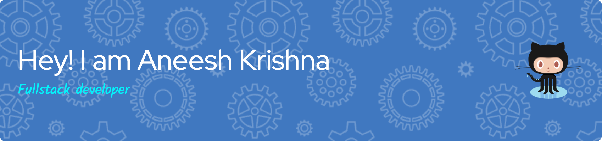

🎓 **CS + Applied Statistics @ Purdue Honors College** 
Focus: Machine Intelligence | Minors: Math & Finance  

💡 **About Me** 
Hi! I’m Aneesh — a curious builder passionate about bridging data, engineering, and design to create impactful, scalable solutions. I enjoy working at the intersection of machine intelligence, finance, and creative technologies.  

💻 **Tech Focus** 
Versatile full-stack engineer and data scientist with a strong foundation in Java, Python, C/C++, Solidity, and JavaScript/TypeScript. Experienced across backend systems, smart contracts, and user-facing interfaces.  

🚀 **Industry Experience** 
- **SWE Intern @ Retail Hedging** — Architected JWT-auth Stripe integrations and developed trading UIs. 
- **Full Stack Intern @ PlaytoonIt** — Shipped cross-platform gaming apps, focusing on seamless user experiences. 
- **Researcher @ Purdue & The Data Mine** — Led data analyses on 18K+ survey responses using R and Python, driving actionable insights.  

⚡ **Interests** 
AI/ML, data engineering, decentralized finance (DeFi), backend & infrastructure, scalable full-stack architectures.  

🛠️ **Selected Projects** 
- **Freelance DAO** — Ethereum-based freelance marketplace with on-chain arbitration mechanisms. 
- **Vibe** — Java-based social networking app featuring real-time messaging and a fully custom GUI.  

📜 **Certifications** 
Python, JavaScript, Cybersecurity, Data Science, Artificial Intelligence, Networking, Ethical Hacking, Network Defense, Cyber-Threat Management (Cisco, CITI, and more). 

## 🌐 Socials:
      

# 💻 Tech Stack:
                                             
# 📊 GitHub Stats:
 
 

## 🏆 GitHub Trophies

### ✍️ Quotes I Like

### 🔝 Top Contributed Repo

---

  ## 💰 You can help me by Donating
    

  
<!-- Proudly created with GPRM ( https://gprm.itsvg.in ) -->
